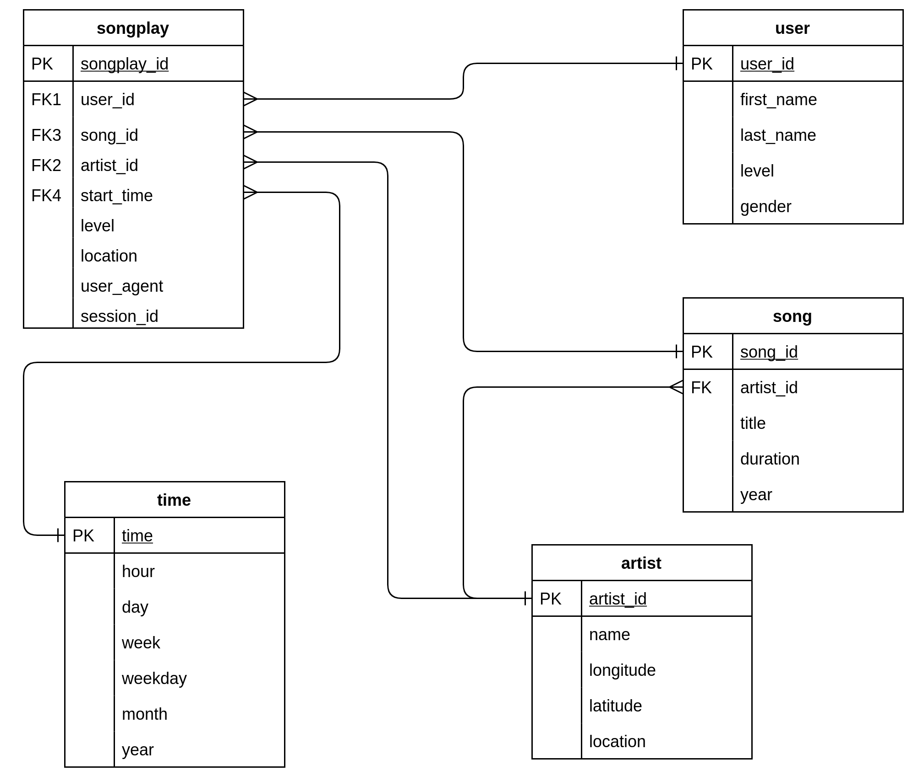

# Data Modelling and ETL with Python and PostgreSQL

A startup called Sparkify wants to analyze the data they've been collecting on songs and user activity on their new music streaming app. The analytics team is particularly interested in understanding what songs users are listening to. Currently, they don't have an easy way to query their data, which resides in a directory of JSON logs on user activity on the app, as well as a directory with JSON metadata on the songs in their app. 

To address this need, `Python` and `SQL` have been used to Extract, Transform and Load (ETL) the data into a `PostgreSQL` database with tables designed to optimize queries on song play analysis. 

Fact and dimension tables have been designed for a star schema database design with a particular analytic focus for the startup. This star schema database design ensures that data integrity is maintained and data redundency is reduced while allowing analysts to search for and analyse data with joins and aggregations.


# Running the code

The follwing files must be executed in order to create the database and run the ETL pipeline:

To create the database and tables:
```bash
python src/create_tables.py
```
To run the ETL pipeline:
```bash
python src/etl.py
```

# Directories in this repository

#### **[data/](data)** 
- Raw JSON data for the songs and logs

#### **[exercises/](exercises)**
- Solutions to Python, SQL and PostgreSQL course exercises.

#### **[notebooks/](notebooks)** 
- Jupyter notebooks used for exploratory data analysis.

#### **[src/](exercises)**
- Python scripts used to create the database and run the ETL pipeline to extract and parse the data from the song and log JSON files before inserting them into the PostgreSQL database tables.
    


# Data model

### Song Plays table
- *Type:* Fact table.
- *Description:* A log table which records each time a user has played a song.

| Field Name | Type | Description |
| ------ | ---- | ----------- |
| `songplay_id` | `SERIAL PRIMARY KEY` | The ID of that particular song play. | 
| `level` | `VARCHAR (10)` | The user's app plan level which can be either `premium` or `free`. |
| `session_id` | `INTEGER` | The ID of that particular session. |
| `location` | `VARCHAR (50)` | The location where the song play happened.  |
| `user_agent` | `VARCHAR (150)` | The user agent for the song play. |
| `start_time` | `TIMESTAMP` | The time when that song play occured. |
| `user_id` | `INTEGER NOT NULL REFERENCES users(user_id)` | The ID of the user who played the song. Since song plays must be triggered by a user, this cannot be null. This references the users table. |
| `song_id` | `VARCHAR REFERENCES songs (song_id)` | The ID of that particular song.  This references the songs table.|
| `artist_id` | `VARCHAR REFERENCES artists (artist_id)` | The ID of that particular artist.  This references the artists table.|


### Users table
- *Type:* Dimension table.
- *Description:* Contains meta data for each user.

| Field Name | Type | Description |
| ------ | ---- | ----------- |
| `user_id` | `INTEGER PRIMARY KEY` | The user ID |
| `first_name` | `VARCHAR (20)` | First name of the user |
| `last_name` | `VARCHAR (20)` | Last name of the user |
| `gender` | `VARCHAR (10)` | The gender of the user |
| `level` | `VARCHAR (10)` | The user's app plan level, which can be either `premium` or `free` |


### Songs table
- *Type:* Dimension table.
- *Description:* Contains meta data for each song.

| Field Name | Type | Description |
| ------ | ---- | ----------- |
| `song_id` | `VARCHAR (50) PRIMARY KEY` | The ID of the song. | 
| `title` | `VARCHAR (100) NOT NULL` | The title of the song which cannot be null. |
| `year` | `INTEGER NOT NULL` | The year that the song was made which cannot be null. |
| `duration` | `FLOAT NOT NULL` | The duration of the song which cannot be null. |
| `artist_id` | `VARCHAR (50) NOT NULL REFERENCES artists (artist_id)` | The artist ID which cannot be null. This field references the artists table. |

### Artists table
- *Type:* Dimension table
- *Description:* Contains meta data for each artist.

| Field Name | Type | Description |
| ------ | ---- | ----------- |
| `artist_id` | `VARCHAR (100) PRIMARY KEY` | The ID of the artist. |
| `name` | `VARCHAR (100) NOT NULL` | The name of the artist. |
| `location` | `VARCHAR (100)` | The location where the artist is based. |
| `latitude` | `FLOAT` | The latitude of where the artist is based. |
| `longitude` | `FLOAT` | The longitude of where the artist is based. |

### Time table
- *Type:* Dimension table
- *Description:* Contains time meta data for each song's log.

| Field Name | Type | Description |
| ------ | ---- | ----------- |
| `start_time` | `TIMESTAMP PRIMARY KEY` | The timestamp when the song was logged. |
| `hour` | `INTEGER NOT NULL` | The hour when the song was logged.  |
| `day` | `INTEGER NOT NULL` | The day when the song was logged. |
| `week` | `INTEGER NOT NULL` | The week when the song was logged. |
| `month` | `INTEGER NOT NULL` | The month when the song was logged. |
| `year` | `INTEGER NOT NULL` | The year when the song was logged. |
| `weekday` | `VARCHAR (10) NOT NULL` | The week day when the song was logged. |
