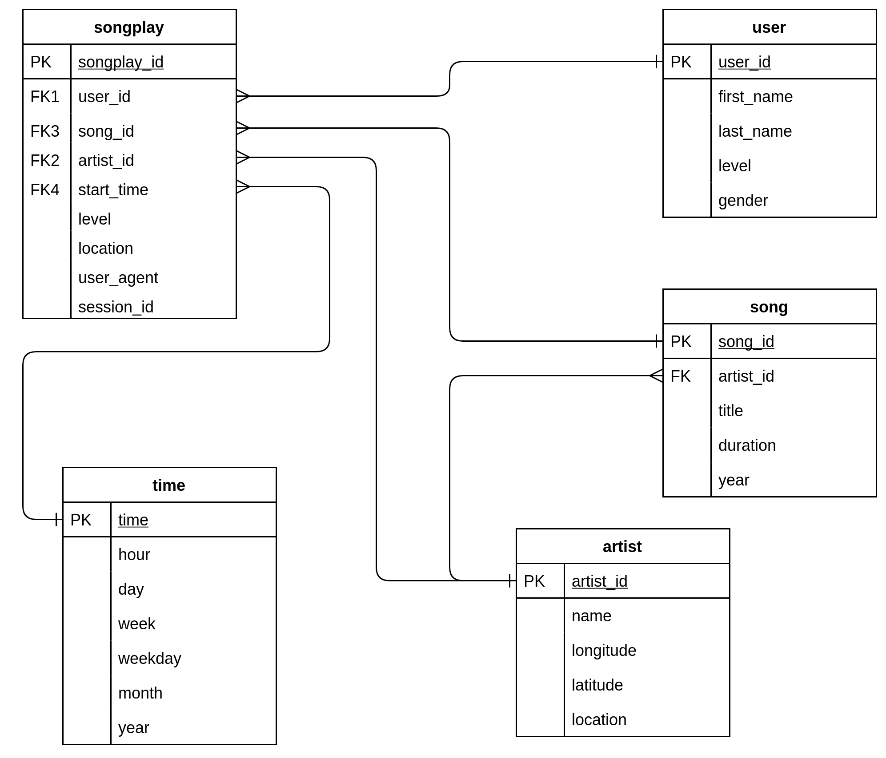

# Data Warehouse Modelling and ETL with Python and AWS Redshift

A startup called Sparkify wants to analyze the data they've been collecting on songs and user activity on their new music streaming app. The analytics team is particularly interested in understanding what songs users are listening to. Currently, they don't have an easy way to query their data, which resides in a directory of JSON logs on user activity on the app, as well as a directory with JSON metadata on the songs in their app. 

To address this need, `Python` and `SQL` have been used to Extract, Transform and Load (ETL) the data into a `AWS Reshift` data warehouse with tables designed to optimize queries on song play analysis. 

# Running the code

Infrastructure as Code using Python creates the necessary AWS services
```bash
python create_redshift_cluster.py
``` 

Create the necessary tables as shown in the entity relationship diagram below. This also includes creating the necessary staging tables.
```bash
python create_tables.py
``` 

Copy the raw data from the S3 bucket into the staging tables, then transform and load this data into the final star schema.
```bash
python etl.py
``` 

Test the the data warehouse tables row counts and entries match pre-defined expected values.
```bash
python data_test_queries.py
``` 

Delete the AWS Redshift cluster and destroy the related infrastructure
```bash
python delete_redshift_cluster.py
``` 

# Data model
